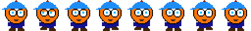

# Sprites

Game animations often make use of what is called a "spritesheet", which is an image containing all the "frames" of an animation for a given element of a game.

No matter the platform we use for a game, the concept of a spritesheet is the same:

1. Load the spritesheet as an image into the web browser.
2. Display just one section of the image at a time to display a frame of the animation.
3. To update the animation, change the section of the image you display.

## Example Sprite

I created a very simple spritesheet using [Piskel App](https://www.piskelapp.com/p/create/sprite). There are other tools you can use as well -- just google "spritesheet creator" to find something; or you can look for previously existing spritesheets you can use in your game from other artists.

Some spritesheets come in rows and columns, to make my first example as simple as possible, I went ahead and set it to export in 1 row, so the image just looks like
a slide reel, like this:



Each frame of my image is 64 by 64 pixels. Over the 8 frames, my little dude picks up each foot twice and blinks his eyes.

We can "play" our image in a plain HTML set-up *or* in a canvas based game. In either case, the concept is the same, we just want to show only a part of the image at a time.

## HTML + CSS-based solution

Using style rules, we can make any element on an HTML page have an image as a background. The key properties to know about are:

* `width` / `height` : specify how big an element shoudl be
* `background-size`: specify how much of the background to show.
* `background-position`: specify where to move the "window" of an image.

When we specify `background-position`, we're effectively positioning the background relative to our "frame", so if we want to move to the right on our spritesheet, we
actually move the background-position to the *left* (think of sliding a big canvas
underneath an unmoving frame -- you would have to slide the canvas to the left to
move the frame over the content to the right).

So in my example, if I set background-position to 0, I see the first frame; if I set 
it to -64px, I'll see the second frame, and so on.

Here is a quick demonstration of how background-position works:



### Creating the Sprite in HTML

To create a sprite in your HTML, you will want to first get your sprite image uploaded onto your server. Then, we'll create a `<div>` in our HTML and set the HTML to be a background image. We can do this *inline* all in HTML or we can do it using a separate *CSS* stylesheet -- whichever you're comfortable with.

#### All-in-one

Supposing your file is at `spritesheet.png` and your sprite is 64x64 pixels, you can create a basic sprite on your page as follow:

```html
<div id="sprite"
  style="
    background-image : url('/spritesheet.png');
    background-size: 64px 64px;
    background-position: 0;
    width: 64px;
    height: 64px;
  "
></div>
```

#### With separate CSS

We can do the exact same thing but using our separate `style.css` file, which gives us a better editing experience since most coding editors will autocomplete CSS correctly inside of a `style.css` file but not in an `html` file:

HTML
```html
<div id="sprite"></div>
```

CSS
```css
#sprite {
  background-image : url('/spritesheet.png');
  background-size: 64px 64px;
  background-position: 0;
  width: 64px;
  height: 64px;
}
```

### Updating the Background Position with JavaScript

Assuming you have a sprite showing up correctly, you can now animate it with some JavaScript. The basic concept is this:

1. Keep track of what frame we're on with a variable.
2. Create an update function which...
   1. Adds 1 to the frame we're on (or cycles back to 0 when we're through)
   2. Calculates the pixel offset based on the frame number and image size.
   3. Updates the background-position property of our sprite div.
3. Use setInterval to call our update function on a timer.


```javascript

// select the item we want -- this assumes we have
// <div id="sprite">
let div = document.querySelector('#sprite'); 

let frame = 0; // current frame
let nframes = 8; // number of frames
let size = 64; // size of each frame

function showNextFrame () {
  frame = (frame + 1) % nframes; // add one, loop back to zero
  let offset = frame * size;
  div.style.backgroundPosition = `-${offset}px`;
}

setInterval( // run forever on a timer
  showNextFrame,
  1000 / 12 // 12 times per second
)

```

## Canvas Based Sprite

We can do the same thing in a canvas using the drawImage method of the 2d drawing context.

The full structure of the `ctx.drawImage` is as follows:


`drawImage(image, sx, sy, sWidth, sHeight, dx, dy, dWidth, dHeight)`

In this case, `sx` and `sy` represent where we want to grab the image from in the source and `dx` and `dy` represent where we want to put the image.

Let's say I wanted to simply display the image to the canvas at over and over, I would start with a call like this:

`drawImage(dudeImage, 0, 0, 64, 64, 0, 0, 64, 64)`

That draws the *first* 64x64 square of my spritesheet.

Then when I update the animation, I would simply make a call like this:
`drawImage(dudeImage, 64, 0, 64, 64, 0, 0, 64, 64)`

Here is the same demo as above, only implemented with a canvas this time:



## Creating a Canvas Based Sprite

The steps to create a canvas based sprite are a little complex. 

1. First, you have to make sure you've loaded you spritesheet -- this is the same as loading any other image. See [images on canvases](../canvas/images.md).
2. Second, you have to decide when you want to update your drawing. You could do this on a timer using requestAnimationFrame or you could do it in response to user input depending on your use case.
3. Third, each time you want to update your sprite, you need to call `drawImage` usin its most verbose form, and update the source offset so you get the next frame of your sprite.

## Wrapping it all up with a bow...

If we wanted to make a game with lots of sprites, it might be handy to make a function which creates our sprite and starts it animating automatically.

Here's what that might look like in practice:


There are of course many approaches to this, but here's a simple functional approach:

HTML

```html
<main id="sprite-area" style="position:relative;width:100vw;height:500px;background-color:#cecece;color:#222;display:flex;place-content:center;">
    Click anywhere in this area to make a new sprite...
  </main>
```


JS

```javascript

// Grab our "area"
let area = document.querySelector('#sprite-area');

// make a sprite for every click
area.addEventListener(
  'click',
  function (e) {    
    makeSprite(e.offsetX,e.offsetY);
  }
);

// Our make sprite function puts a sprite at a position
function makeSprite (x,y) {
  let div = document.createElement('div');
  div.style.backgroundImage = 'url(dude.png)';
  div.style.width = '64px';
  div.style.height = '64px';
  div.style.top = `${y-32}px`;
  div.style.left = `${x-32}px`;
  div.style.position = 'absolute';
  area.appendChild(div);
  
  let frame = 0;
  let nframes = 8;
  let size = 64;
  let speed = 2 + Math.random() * 10;
  window.setInterval(function () {
      frame = (frame + 1) % nframes;
      let offset = frame * size;
      div.style.backgroundPosition = `-${offset}px`;     
      x += speed;        
      if (x > area.clientWidth) {
        x = 0;
      }
      div.style.left = `${x-32}px`
    }, 1000 / 6);
}
```

A similar technique could be used with a canvas or, as in the example above, HTML + CSS styles.
