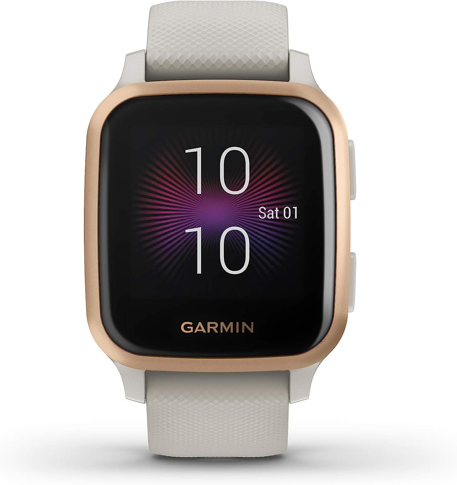

# Positioning an Image

My final step in a layout will be absolute positioning anything that needs to be absolute positioned.

In my case, I have a watch I need to add that looks like this:


;

My goal is to create this:


Currently, I have the following layout, basically arranged around two columns like this:

```html
<main>
    <section class="column left grey">
        <div class="text">
        <div class="rotated title">
            <div class="product">Venu<sup
            class="tiny">®</sup> 
                Sq
            </div>
    <div class="descr">GPS Smartwatch</div>
</div>
        </div>
    </section>
    <section class="column right white">
        <div class = "square-grid">
            <div class="item">Watch 1</div>
            <div class="item">Watch 2</div>
            <div class="item">Watch 3</div>
            <div class="item">Watch 4</div>
        </div>
    </section>
</main>
```



main {
    height: 600px;
    width: 600px;
    display: flex;
    flex-direction: row;
}
section {
    display: grid;
    align-items: center;
    height: 100%;
}
.left {
    width: 38%;
}
.right {
    width: 62%;
    justify-content: center;
}
.grey {
    background-color: grey;
}
.white {
    background-color: offwhite;
}
.square-grid {
    display: grid;
    grid-template-rows: 100px 100px;
    grid-template-columns: 100px 100px;
    gap: 10px;
}
.square-grid .item {
    background-color: orange;
    width: 100%;
    height: 100%;
}
.title {
height: 300px;
width: 300px;
font-family: sans-serif;
text-transform: uppercase;
color: white;
text-align: center;
display: grid;
place-content: center;
}
.product {
    font-size: 60px;

}
.tiny {
    font-size: 16px;
    position: relative;
    top: -16px;
}
.descr {
    font-size: 28px;
    letter-spacing: 1px;
}
.rotated {
    transform: translateY(-25%);
    rotate: 270deg;
}


<main>
    <section class="column left grey">
        <div class="text">
            <div class="rotated title">
                <div class="product">Venu<sup
                class="tiny">®</sup> 
                    Sq
                </div>
                <div class="descr">GPS Smartwatch</div>
            </div>
        </div>
    </section>
    <section class="column right white">
        <div class = "square-grid">
            <div class="item">Watch 1</div>
            <div class="item">Watch 2</div>
            <div class="item">Watch 3</div>
            <div class="item">Watch 4</div>
        </div>
    </section>
</main>



When it comes time to add my new watch image, I basically want to line it up with the left hand column, so I'm going to add CSS rules to make the left hand column `position: relative` and then make the watch `position: absolute`

```css

.left {
    position: relative;
}
.left img {
    
    position: absolute;
    /* Start with us on the right and guessing the size*/
    /* I'll have to tweak these number in the editor to get everything
    looking just right */
    height: 370px;
    right: -100px;
    /* Center vertically */
    top: 50%;
    transform: transposeY(-50%);
}
```

Here's a first approximation of my imitation. To get this dead on would involve
resizing the grey and white bar until the watch band lines up perfectly and the text
is overlapped by just the right amount. That's just a question of playing with the 
`height`, `width` and `right` properties until you're happy -- it's best to do these things
in the inspector of the browser once you have all your final images and fonts chosen
so you can tweak until it looks pixel perfect.


.left {
    position: relative;
}
.left img {
    position: absolute;
    /* Start with us on the right */
    right: -170px;
    /* Center vertically */
    top: 50%;
    height: 370px;
    transform: translateY(-50%);
}
main {
    height: 600px;
    width: 600px;
    display: flex;
    flex-direction: row;
}
section {
    display: grid;
    align-items: center;
    height: 100%;
}
.left {
    width: 38%;
}
.right {
    width: 62%;
    justify-content: center;
}
.grey {
    background-color: grey;
}
.white {
    background-color: offwhite;
}
.square-grid {
    display: grid;
    grid-template-rows: 100px 100px;
    grid-template-columns: 100px 100px;
    gap: 10px;
}
.square-grid .item {
    background-color: orange;
    width: 100%;
    height: 100%;
}
.title {
    height: 300px;
    width: 300px;
    font-family: sans-serif;
    text-transform: uppercase;
    color: white;
    text-align: center;
    display: grid;
    place-content: center;
}
.product {
    font-size: 60px;

}
.tiny {
    font-size: 16px;
    position: relative;
    top: -16px;
}
.descr {
    font-size: 28px;
    letter-spacing: 1px;
}
.rotated {
    transform: translateY(-25%);
    rotate: 270deg;
}
.item {
    display: grid;
    place-content: center;
    overflow: hidden;
}
.item img {
    width: 100%;    
    filter: drop-shadow(2px 4px 6px black);
}
/* Colors for the items in the grid */
.item:nth-child(1) {
    background-color: #e7decc
}
.item:nth-child(2) {
    background-color: #fae6d2
}
.item:nth-child(3) {
    background-color: #908e8f
}
.item:nth-child(4) {
    background-color: #7b7a6f
}


<main>
    <section class="column left grey">
        <div class="text">
            <div class="rotated title">
                <div class="product">Venu<sup
                class="tiny">®</sup> 
                    Sq
                </div>
                <div class="descr">GPS Smartwatch
                </div>
            </div>
        </div>
        
    </section>
    <section class="column right white">
        <div class = "square-grid">
            <div class="item">
                
            </div>
            <div class="item">
                
            </div>
            <div class="item">
                
            </div>
            <div class="item">
                
            </div>
        </div>
    </section>
</main>

