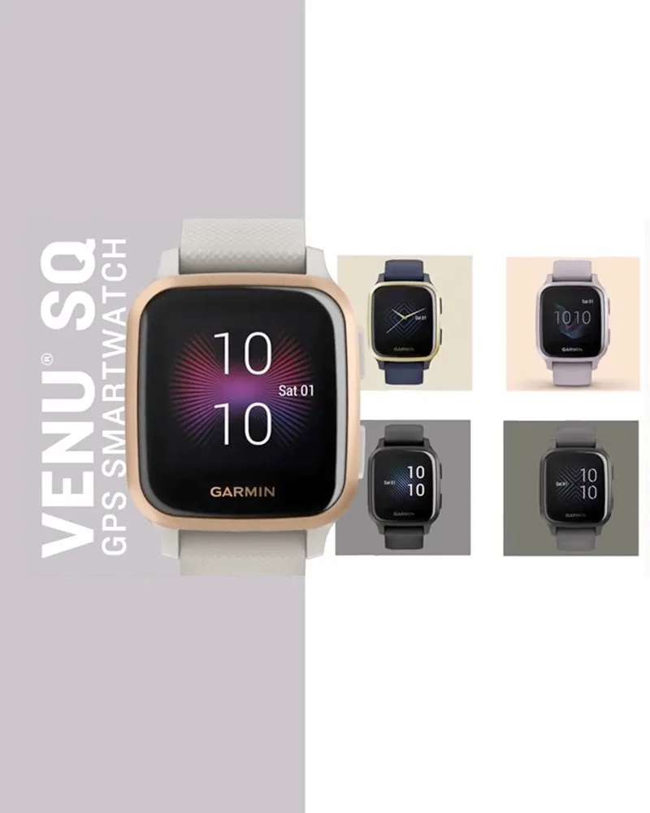

# Laying out the text

For any layout, you will have some text to lay out. The firt step will be to notice how the text is grouped, and put it into HTML. You can use `<div>` for any lines of text and `<span>` for any formatting changes *within* a line.

I recommend using class names that make sense to you. Here's a reasonable way to title the text in my example layout:

```html
<div class="rotated title">
    <div class="product">Venu<sup class="superscript tiny">®</sup> Sq</div>
    <div class="desc">GPS Smartwatch</div>
</div>
```




My next step would be to get that text into roughly the correct sizes and font. Here's an attempt:

```css
.title {
    font-family: sans-serif;
    text-transform: uppercase;
    width: 400px;
    background-color: grey;
    color: white;
}
.product {
    font-size: 60px;
    font-weight: bold;
}
.tiny {
    font-size: 16px;
}
.desc {
    font-size: 28px;
}
```



.title {
    width: 300px;
    font-family: sans-serif;
    text-transform: uppercase;
    background-color: grey;
    color: white;
}
.product {
    font-size: 60px;
}
.tiny {
    font-size: 16px;    
}
.descr {
    font-size: 28px;
   
}


<div class="rotated title">
    <div class="product">Venu<sup
    class="tiny">®</sup> 
        Sq
    </div>
    <div class="descr">GPS Smartwatch</div>
</div>



## Tweaking

Once you have the font size and the basic look correct, you can tweak with css properties like letter-spacing and (worst-case) some relative positioning nudging to get text to look exactly the way you want it to.


.title {
    width: 300px;
    font-family: sans-serif;
    text-transform: uppercase;
    background-color: grey;
    color: white;
    text-align: center;
}
.product {
    font-size: 60px;
    
}
.tiny {
    font-size: 16px;
    position: relative;
    top: -16px;
}
.descr {
    font-size: 28px;
    letter-spacing: 1px;   
}


<div class="rotated title">
    <div class="product">Venu<sup
    class="tiny">®</sup> 
        Sq
    </div>
    <div class="descr">GPS Smartwatch</div>
</div>

