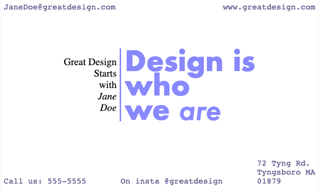

# A Business Card: Nested Flex Boxes

When you have a complex layout, you often want to think of it as multiple boxes, some of which may work in different directions.

Let's look, for example, at a business card with a header, a footer, and a center.



The header involves info in the left and right corners of the card.
The body has a left/right design that should be centered.

Finally, the footer has items in the left, center and right bottom.

As I lay the card out I'll start with the biggest container: the outer box.

I'll add the following style rules for the main box to make the three parts of the card spread out... as I work, I'm going to put borders on everything so I can see the boxes the browser is using.

```css
  main {
      display: flex;
      flex-direction: column;
      justify-content: space-between;
      
  }
  
```



main {
      width: 500px;
      height: 300px;
      border: 1px solid #efefef;
      display: flex;
      flex-direction: column;
      justify-content: space-between;
      
  }      
  
  main {
      border: 1px solid red;
  }
  section {
      border: 1px solid blue;
  }
  div {
      border: 1px solid grey; 
  }


<main>
  <header>
    <div>
      JaneDoe@greatdesign.com
    </div>
    <div>
      www.greatdesign.com
    </div>
  </header>
  <section>
     <div>
       Great Design
       <br>Starts
       <br>with <em>Me</em>
     </div>
     <h2>
       Design
       <br>is <em>who</em>
       <br>we <em>are</em>
     </h2>
  </section>
  <footer>
    <div>Call us: 555-5555</div>
    <div>On insta @greatdesign</div>
    <div>72 Tyng Rd. <br>Tyngsboro MA<br>01879</div>
  </footer>
</main>




Next up, I need to make each of my internal flex-boxes move left to right.

I'll add a rule for them:
```css
header, footer, section {
    display: flex;
    flex-direction: row;
}
```



main {
      width: 500px;
      height: 300px;
      border: 1px solid #efefef;
      display: flex;
      flex-direction: column;
      justify-content: space-between;
      
  }      
  
  /* left-right layout for inner boxes */
  header, footer, section {
    display: flex;
    flex-direction: row;
  }
  
  /* Colors for troubleshooting */
  main {
      border: 1px solid red;
  }
  section {
      border: 1px solid blue;
  }
  div {
      border: 1px solid grey; 
  }


<main>
  <header>
    <div>
      JaneDoe@greatdesign.com
    </div>
    <div>
      www.greatdesign.com
    </div>
  </header>
  <section>
     <div>
       Great Design
       <br>Starts
       <br>with <em>Me</em>
     </div>
     <div>
       Design
       <br>is <em>who</em>
       <br>we <em>are</em>
     </div>
  </section>
  <footer>
    <div>Call us: 555-5555</div>
    <div>On insta @greatdesign</div>
    <div>72 Tyng Rd. <br>Tyngsboro MA<br>01879</div>
  </footer>
</main>



Last up, I need to adjust the alignment for each box
inside my card.

* Header: align on top and spread out
* Section: align in the center
* Footer: align on the bottom and spread out

```css
header {
    align-items: flex-start;
    justify-content: space-between;
}
footer {
    align-items: flex-end;
    justify-content: space-between;
}
section {
    align-items: center;
    justify-content: center;
}
```



main {
      width: 500px;
      height: 300px;
      border: 1px solid #efefef;
      display: flex;
      flex-direction: column;
      justify-content: space-between;
      
  }      
  
  /* left-right layout for inner boxes */
  header, footer, section {
    display: flex;
    flex-direction: row;
  }
  
  header {
    align-items: flex-start;
    justify-content: space-between;
  }
footer {
    align-items: flex-end;
    justify-content: space-between;
}
section {
    align-items: center;
    justify-content: center;
}
  
  /* Colors for troubleshooting */
  main {
      border: 1px solid red;
  }
  section {
      border: 1px solid blue;
  }
  div {
      border: 1px solid grey; 
  }


<main>
  <header>
    <div>
      JaneDoe@greatdesign.com
    </div>
    <div>
      www.greatdesign.com
    </div>
  </header>
  <section>
     <div>
       Great Design
       <br>Starts
       <br>with <em>Me</em>
     </div>
     <h2>
       Design
       <br>is <em>who</em>
       <br>we <em>are</em>
     </h2>
  </section>
  <footer>
    <div>Call us: 555-5555</div>
    <div>On insta @greatdesign</div>
    <div>72 Tyng Rd. <br>Tyngsboro MA<br>01879</div>
  </footer>
</main>




Now that everything is positioned right, you can play with the rest of your layout. Here's a "final" card:



main {
      width: 500px;
      height: 300px;
      border: 1px solid #efefef;
      display: flex;
      flex-direction: column;
      justify-content: space-between;
      margin: auto;
      background-color: white;
      padding: 5px;
  }      
  body {
    background-color: black;
  }

  /* left-right layout for inner boxes */
  header, footer, section {
    display: flex;
    flex-direction: row;
  }

  header {
    align-items: flex-start;
    justify-content: space-between;
  }
footer {
    align-items: flex-end;
    justify-content: space-between;
    padding-bottom: 5px;
}
section {
    align-items: center;
    justify-content: center;
}

  header, footer {
    font-family: Monospace;
    color: #558;
  }


<main>
  <header>
    <div>
      JaneDoe@greatdesign.com
    </div>
    <div>
      www.greatdesign.com
    </div>
  </header>
  <section>
     <div style="text-align: right; padding-right: 5px;">
       Great Design
       <br>Starts
       <br>with <br><em>Jane <br>Doe</em>
     </div>
     <h2 style="color: #88f; padding-left: 5px; font-size: 44px; font-family: Futura; line-height: 0.9; border-left: 3px solid #88f;">
       Design is 
       <br>who
       <br>we <em>are</em>
     </h2>
  </section>
  <footer>
    <div>Call us: 555-5555</div>
    <div>On insta @greatdesign</div>
    <div>72 Tyng Rd. <br>Tyngsboro MA<br>01879</div>
  </footer>
</main>


