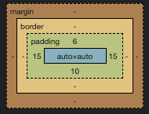

## The Box Model

Every **block** element is its own box. Boxes have *Four* parts:

* Content (what's in the box)
* Border (what's drawn around the box)
* Padding (space between the border and content)
* Margin (space around the box)


<div>This is a plain box: no border, no padding, no margin</div>
<div style="border: 3px solid blue; padding: 10px">This is a box
with border and padding.</div>
<div style="border: 3px solid blue; margin: 10px">This is a box
with border and a margin.</div>
<div style="margin-left: 20px; padding-right: 15px; border: 5px solid blue">This is a box
with a margin on only one side, padding on the other side, and 
a really ugly blue border
</div>



## Sizing Boxes

All of the boxes above were sized based on how much text was in them. If you want to make a box an exact size, you can give it a width or a height.

By default, the width and the height is *before* you add padding and the border, which is confusing to most students.

You can use the property **box-sizing** to change the sizing method to one that makes more sense, which is `box-sizing: border-box`. The *default* setting is "content-box" which means when you say an element has `width: 200px`, the total width will actually not be 200px but rather 200px + the left and right padding and the left and right border width. In my experience, most people want the element size to include the border and padding already, which is what `box-sizing: border-box` will do.

```html.run

    header,main,footer {
        background-color: #0033a0;
        color: white;
        border: 4px solid #c6093b;
        margin-bottom: 5px;
        padding: 10px;

    }
    main {
        width: 300px;
        height: 200px;
    }
    footer {
        width: 300px;
        height: 200px;
        box-sizing: border-box;
    }


<header>This box has no sizing rules.</header>
<main>This box uses standard box sizing. The content is exactly 300px by 200px, but the whole box, with padding, is 328px by 228px because there are 10px of padding all around + a 4px border.</main>
<footer>
  This box uses border-box sizing. It is exactly 300px by 200px, with the padding and border
  included in the width and height properties.
</footer>




Your browser's inspector does a great job of showing you the box model
for any element. If you click on any element on any web page and select "Inspect" you can see a beautiful diagram of a box model.

