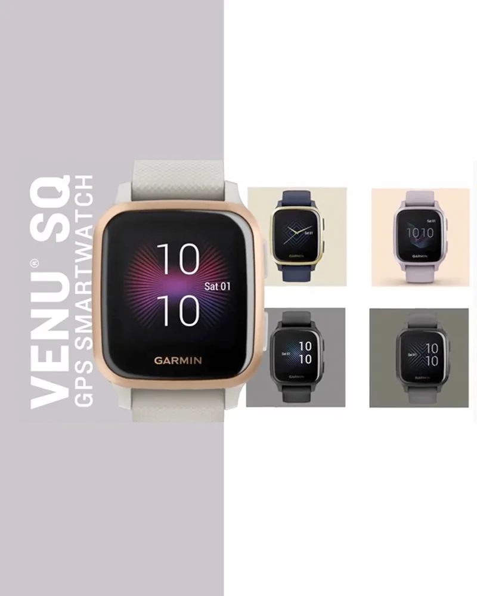

# Getting the basic sizing right.


The first thing I notice about this image is the way the gray and the white split the image.

To begin with, I'm going to just create a container for the whole image and then size them. It helps to create simple containers with simple class names for your ideas, like this:

```html

<main>
    <section class="grey left">
        (text)
    </section>
    <section class="white right">
        (watch grid)
    </section>
</main>
```

I added *class names* to my sections to mirror what is going on in my initial design.

I'll make some best guesses about sizing next:

```css

main {
    /* It's basically square */
    width: 600px;
    height: 600px; 
    display: flex; /* Left-to-right */
}

.left {
    width: 38%;
}
.right {
    width: 62%;
}
.grey {
    background-color: grey;
}
.white {
    background-color: #fefefe;
}
```

Here's how that looks:


main {
    /* It's basically square */
    width: 600px;
    height: 600px; 
    display: flex; /* left-to-right */
}

.left {
    width: 38.2%;
}
.right {
    width: 61.8%;
}
.grey {
    background-color: grey;
}
.white {
    background-color: #fefefe;
}


<main>
    <section class="grey left">
    (watch text)
    </section>
    <section class="white right">
    (watch grid)
    </section>
</main>



